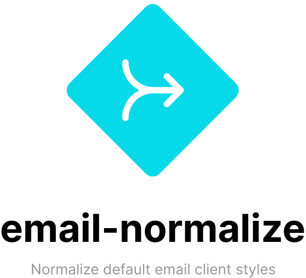

<div align="center">
    
    <br>
    <br>
</div>

# About

**This is a work in progress, please check back soon! ✌**

> CSS resets for default styles in email clients

Like browsers, email clients use default styles for HTML.

_Unlike_ browsers, there is little to no standardization, and email developers need to be familiar with many, constantly changing CSS reset techniques.

`email-normalize` tries to help by providing an up-to-date, community-maintained list of CSS snippets that you can use to normalize styles in HTML emails.

## Install

```sh
npm install @maizzle/email-normalize
```

## Usage

### In CSS:

```css
@import 'node_modules/@maizzle/email-normalize/email-normalize.css';
```

### In HTML:

```html
<link rel="stylesheet" href="node_modules/@maizzle/email-normalize/email-normalize.css">
```

### In PostCSS:

```css
@import '@maizzle/email-normalize';
```

### In your app:

```js
const rules = require('@maizzle/email-normalize')
```

`rules` is an object containing CSS resets organized by email client.

Example:

```js
module.exports = {
  generic: [
    {
      css: 'img { -ms-interpolation-mode: bicubic !important; }',
      description: '`-ms-interpolation-mode` was used for re-sampling images that needed to stretch. Since IE8, this has been set as `bicubic`. This now only works in IE11, which also has a default of `bicubic`. Outlook also has `bicubic` set as default.',
      can_inline: true,
      deprecated: 1655240400000, // June 15, 2022
    }
  ]
}
```

In this example, the `generic` key represents the email client.

#### Rule keys

Each `rule` object includes several keys that you can use.

#### `css`

Type: `string`

The CSS code, without line breaks or comments.

#### `description`

Type: `string`

A description of what the reset does (or did).

#### `can_inline`

Type: `undefined|boolean`\
Default: `undefined`

Boolean indicating if the CSS reset can be used inline.

#### `deprecated`

Type: `undefined|number`\
Default: `undefined`

Timestamp indicating the date when the CSS reset was deprecated.

These are approximations based on personal experience, unless otherwise noted.

## Credits

Name and logo inspired by [modern-normalize](https://github.com/sindresorhus/modern-normalize/).

Free ["merge" SVG icon](https://www.flaticon.com/free-icon/merge_3580192) by [mavadee](https://www.flaticon.com/authors/mavadee).
