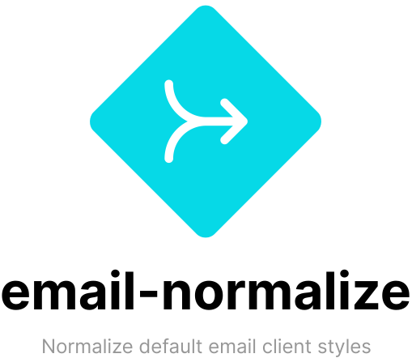

<div align="center">
    
    <br>
    <br>
</div>

# About

**This is a work in progress, please check back soon! ✌**

> CSS resets for default styles in email clients

Like browsers, email clients use default styles for HTML.

_Unlike_ browsers, there is little to no standardization, and email developers need to be familiar with many, constantly changing CSS reset techniques.

`email-normalize` tries to help by providing an up-to-date, community-maintained list of CSS snippets that you can use to normalize styles in HTML emails.

## Install

```sh
npm install @maizzle/email-normalize
```

## Usage

In CSS:

```css
@import 'node_modules/@maizzle/email-normalize/email-normalize.css';
```

In HTML:

```html
<link rel="stylesheet" href="node_modules/@maizzle/email-normalize/email-normalize.css">
```

In PostCSS:

```css
@import '@maizzle/email-normalize';
```


## Credits

Name and logo inspired by [modern-normalize](https://github.com/sindresorhus/modern-normalize/).

Free ["merge" SVG icon](https://www.flaticon.com/free-icon/merge_3580192) by [mavadee](https://www.flaticon.com/authors/mavadee).
